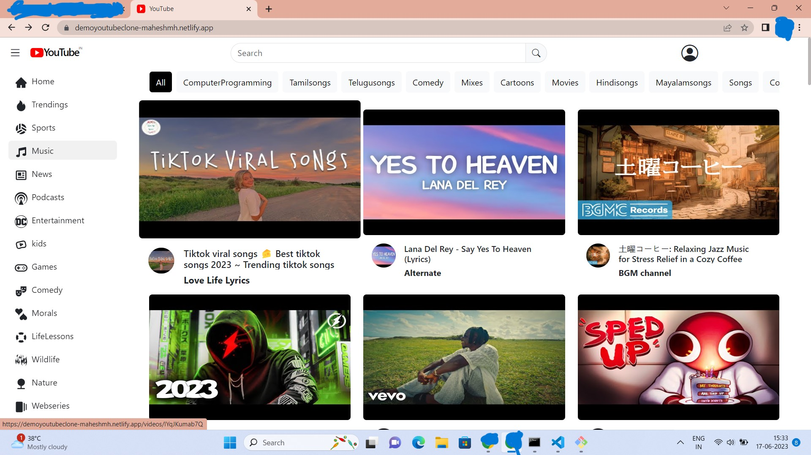

# YoutubeCloneDemo

=>LIVELink : https://demoyoutubeclone-maheshmh.netlify.app

=> Tech Stack that I used to build these youtube clone are
>>Reactjs
>>Nodejs
>>Expressjs
>>Mongodb
>>Firebase

=> It is deployed by using netlify and render.com

=> some of the screenshots are below 

